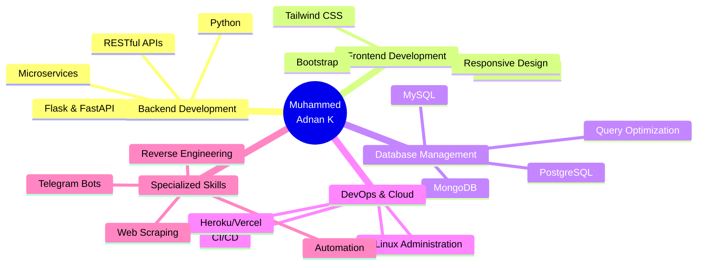

<div align="center">


<p align="center">
  
</p>

<p align="center">
  <a href="https://linkedin.com/in/adnanxpkd"></a>
  <a href="https://t.me/adnanxpkd"></a>
  <a href="mailto:adnanxpkd@gmail.com"></a>
  <a href="https://instagram.com/adnanxpkd"></a>
  <a href="https://github.com/adnanxpkd"></a>
</p>

<p align="center">
  
  
  
</p>

</div>

---


## 👨‍💻 About Me

```python
#!/usr/bin/env python3
# -*- coding: utf-8 -*-

class AdnanK:
    def __init__(self):
        self.username = "adnanxpkd"
        self.name = "Muhammed Adnan K"
        self.role = "Python Full Stack Developer"
        self.location = "Kerala, India 🇮🇳"
        self.community = "@AiTechWaveML"
        self.languages = {
            "spoken": ["Malayalam", "English", "Hindi"],
            "programming": ["Python", "JavaScript", "SQL"]
        }
        
    def current_focus(self):
        return [
            "🔥 Building scalable web applications",
            "🤖 AI/ML integration & automation",
            "📱 Advanced Telegram bot development",
            "☁️ Cloud architecture & DevOps",
            "🌟 Open source contributions"
        ]
    
    def life_philosophy(self):
        return "Learn. Build. Share. Repeat. 🚀"

developer = AdnanK()
print(developer.life_philosophy())
```

<br clear="right"/>

### 🎯 What I Do

- 💻 **Full Stack Development:** Crafting robust web applications with Python backend and modern frontend
- 🤖 **Bot Automation:** Creating intelligent Telegram bots and automation solutions
- 🔍 **Problem Solving:** Reverse engineering and finding creative solutions to complex challenges
- 📚 **Content Creation:** Sharing tech knowledge through [@AiTechWaveML](https://t.me/AITechWaveML) community
- 🌱 **Continuous Learning:** Always exploring emerging technologies and best practices

---

## 🛠️ Technology Arsenal

<div align="center">

### Core Technologies

<table>
<tr>
<td align="center" width="96">

<br>Python
</td>
<td align="center" width="96">

<br>JavaScript
</td>
<td align="center" width="96">

<br>HTML5
</td>
<td align="center" width="96">

<br>CSS3
</td>
<td align="center" width="96">

<br>Flask
</td>
<td align="center" width="96">

<br>FastAPI
</td>
<td align="center" width="96">

<br>Bootstrap
</td>
<td align="center" width="96">

<br>Tailwind
</td>
</tr>
</table>

### Database & Storage

<table>
<tr>
<td align="center" width="96">

<br>MongoDB
</td>
<td align="center" width="96">

<br>MySQL
</td>
<td align="center" width="96">

<br>PostgreSQL
</td>
<td align="center" width="96">

<br>SQLite
</td>
<td align="center" width="96">

<br>Redis
</td>
</tr>
</table>

### DevOps & Tools

<table>
<tr>
<td align="center" width="96">

<br>Git
</td>
<td align="center" width="96">

<br>GitHub
</td>
<td align="center" width="96">

<br>Docker
</td>
<td align="center" width="96">

<br>Linux
</td>
<td align="center" width="96">

<br>VS Code
</td>
<td align="center" width="96">

<br>Postman
</td>
<td align="center" width="96">

<br>Heroku
</td>
<td align="center" width="96">

<br>Vercel
</td>
</tr>
</table>

</div>

---

## 📊 GitHub Analytics Dashboard

<div align="center">
  
  
</div>

<div align="center">
  
  
</div>

---

## 🏆 GitHub Achievements & Trophies

<div align="center">


</div>

---

## 📈 Contribution Graph

<div align="center">

[](https://github.com/adnanxpkd)

</div>

---

## 🐍 Contribution Snake Animation

<div align="center">

<picture>
  <source media="(prefers-color-scheme: dark)" srcset="https://raw.githubusercontent.com/platane/snk/output/github-contribution-grid-snake-dark.svg">
  <source media="(prefers-color-scheme: light)" srcset="https://raw.githubusercontent.com/platane/snk/output/github-contribution-grid-snake.svg">
  
</picture>

</div>

---

## 💼 Skills Breakdown

<div align="center">



</div>

---

## 🎓 Currently Learning & Exploring

<div align="center">

| Technology | Progress | Focus Area |
|------------|----------|------------|
| 🤖 Machine Learning |  | AI Integration & Model Deployment |
| ☁️ Cloud Architecture |  | AWS & Azure Services |
| 🔒 Cybersecurity |  | Web Security & Penetration Testing |
| 📱 React.js |  | Modern Frontend Development |
| 🐳 Kubernetes |  | Container Orchestration |

</div>

---

## 🌟 Featured Projects

<div align="center">

[](https://github.com/adnanxpkd)
[](https://github.com/adnanxpkd)

</div>

---

## 💡 Random Dev Quote

<div align="center">


</div>

---

## 📫 Let's Connect & Collaborate!

<div align="center">

<table>
<tr>
<td align="center" width="200">
<a href="https://linkedin.com/in/adnanxpkd">

<br><b>LinkedIn</b>
<br><sub>Professional Network</sub>
</a>
</td>
<td align="center" width="200">
<a href="https://t.me/adnanxpkd">

<br><b>Telegram</b>
<br><sub>Quick Chat</sub>
</a>
</td>
<td align="center" width="200">
<a href="mailto:adnanxpkd@gmail.com">

<br><b>Gmail</b>
<br><sub>Email Me</sub>
</a>
</td>
<td align="center" width="200">
<a href="https://instagram.com/adnanxpkd">

<br><b>Instagram</b>
<br><sub>Social Updates</sub>
</a>
</td>
</tr>
<tr>
<td align="center" colspan="4">
<br>
<a href="https://t.me/AITechWaveML">

</a>
<br><sub>🚀 AI & Tech Insights in Malayalam</sub>
</td>
</tr>
</table>

</div>

---

<div align="center">

### 💬 Ask Me About

`Python` • `Web Development` • `Telegram Bots` • `Automation` • `Database Design` • `API Development` • `Cloud Deployment` • `Open Source`

### ⚡ Fun Facts

- 🎯 **Self-taught developer** who believes in learning by building
- 🌙 **Night owl coder** - best ideas come after midnight
- ☕ **Coffee enthusiast** - Code better with caffeine
- 🎮 **Problem solver** - Debugging is like detective work
- 🌍 **Community builder** - Sharing knowledge is growing together

---

### 📊 Weekly Development Breakdown

<!--START_SECTION:waka-->
```text
Python       12 hrs 30 mins  ████████████░░░░░  65.2%
JavaScript   3 hrs 15 mins   ████░░░░░░░░░░░░░  17.0%
HTML/CSS     2 hrs 10 mins   ███░░░░░░░░░░░░░░  11.3%
SQL          45 mins         █░░░░░░░░░░░░░░░░   3.9%
Other        30 mins         ░░░░░░░░░░░░░░░░░   2.6%
```
<!--END_SECTION:waka-->

---


<p align="center">
  
</p>

<p align="center">
  <i>⚡ "Code is poetry written in logic" ⚡</i>
  <br><br>
   <em><b>I love connecting with different people</b> so if you want to say <b>hi, I'll be happy to meet you more!</b> 😊</em>
</p>

</div>

<!-- 
🎨 Crafted with ❤️, ☕, and countless hours of coding by Muhammed Adnan K
🚀 Last Updated: Dynamic
⭐ If you like my work, please star my repositories!
🤝 Always open to interesting projects and collaboration opportunities
📧 Feel free to reach out for any queries or discussions
-->
