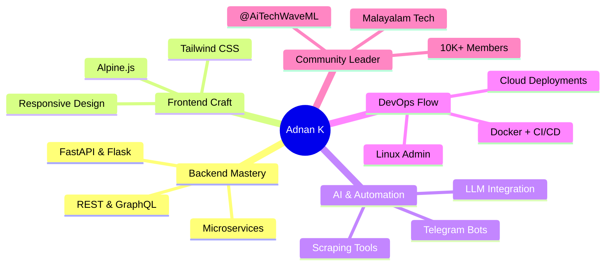

<div align="center">
  
  
  <p>
    
  </p>

  <!-- Social Badges -->
  <p>
    <a href="https://linkedin.com/in/adnanxpkd"></a>
    <a href="https://t.me/adnanxpkd"></a>
    <a href="mailto:adnanxpkd@gmail.com"></a>
    <a href="https://instagram.com/adnanxpkd"></a>
    <a href="https://github.com/adnanxpkd"></a>
  </p>


  <!-- Views & Followers -->
  <p>
    
    
    
  </p>
</div>

<p align="center">

</p>

---


## 🚀 About Me
```python
class AdnanK:
    def __init__(self):
        self.name = "Muhammed Adnan K"
        self.location = "Kerala, India 🇮🇳"
        self.role = "Python Full Stack Developer"
        self.passion = ["AI", "Automation", "Open Source", "Community"]
        self.current_mission = "Turning ideas into scalable reality"
    
    def skills(self):
        return {
            "Backend": ["Python", "FastAPI", "Flask", "Django"],
            "Frontend": ["HTML", "CSS", "JavaScript", "Tailwind"],
            "Databases": ["MongoDB", "PostgreSQL", "Redis"],
            "DevOps": ["Docker", "Linux", "Vercel", "Heroku"],
            "Specialty": ["Telegram Bots", "Web Scraping", "Reverse Engineering"]
        }
    
    def mantra(self):
        return "Code. Learn. Build. Share. Repeat. 🚀"

dev = AdnanK()
print(dev.mantra())
```
<br clear="right"/>

### 🎯 What I’m Building
- 🔥 Scalable web apps with **FastAPI + React**
- 🤖 Advanced **Telegram bots** with AI & payments
- 🧠 AI-powered automation tools
- ☁️ Cloud-native deployments (Docker + CI/CD)
- 🌟 Leading **@AiTechWaveML** – Kerala's largest AI community (Malayalam)

---
## 🛠️ Tech Stack & Tools
<div align="center">

### Languages & Frameworks


### Databases & Cloud


### Tools & DevOps


</div>

---
## 📊 GitHub Stats Dashboard
<div align="center">
  
  
</div>

<div align="center">
   </div>

---


---
## 🏆 GitHub Trophies
<div align="center">
  
</div>

---
## 🐍 Contribution Snake (Dark/Light Mode)
<div align="center">
  <picture>
    <source media="(prefers-color-scheme: dark)" srcset="https://raw.githubusercontent.com/platane/snk/output/github-contribution-grid-snake-dark.svg" />
    <source media="(prefers-color-scheme: light)" srcset="https://raw.githubusercontent.com/platane/snk/output/github-contribution-grid-snake.svg" />
    
  </picture>
</div>

---
## 🚀 Skills Matrix
<div align="center">

</div>

---
## 🌱 Currently Mastering
<div align="center">

| Skill                  | Progress| Target |
|------------------------|--------|--------|
| 🤖 Machine Learning    |   80%  | Production ML |
| ☁️ AWS & Azure         |   70%  | Certified |
| ⚡ React + Next.js      |   75%  | Full-Stack Pro |
| 🔐 Ethical Hacking     |   65%  | Bug Bounty |
| 🐙 Kubernetes          |   50%  | Orchestration |

</div>

---
## 📈 Weekly Coding Time
<!--START_SECTION:waka-->
```text
Python       14 hrs 20 mins   ████████████████░░░░░   72.1%
JavaScript   3 hrs 50 mins    ████░░░░░░░░░░░░░░░░░   19.3%
HTML/CSS     1 hr 40 mins     ██░░░░░░░░░░░░░░░░░░░   8.4%
SQL          30 mins          █░░░░░░░░░░░░░░░░░░░░   2.5%
Other        15 mins          ░░░░░░░░░░░░░░░░░░░░░   1.2%
```
<!--END_SECTION:waka-->

---
## 🤝 Let's Connect!
<div align="center">

| Platform       | Link                                                    | Purpose                     |
|----------------|---------------------------------------------------------|-----------------------------|
| 💼 LinkedIn    | [adnanxpkd](https://linkedin.com/in/adnanxpkd)          | Professional & Networking   |
| 💬 Telegram    | [adnanxpkd](https://t.me/adnanxpkd)                    | Quick Chats & Collabs       |
| 📧 Email       | [adnanxpkd@gmail.com](mailto:adnanxpkd@gmail.com)       | Projects & Opportunities    |
| 🚀 Community   | [AiTechWaveML](https://t.me/AITechWaveML)              | **AI Updates**        |

<a href="https://t.me/AITechWaveML">
  
</a>

</div>

---
<div align="center">
  
  
  <p>
    
  </p>

  <p>
    
    <i><b>Love connecting with builders!</b> Drop a Hi on Telegram – I reply to everyone 😊</i>
  </p>

  <sub>✨ <b>Crafted with ❤️, ☕ and 200+ hours of coding by Muhammed Adnan K</b> ✨</sub>
</div>

